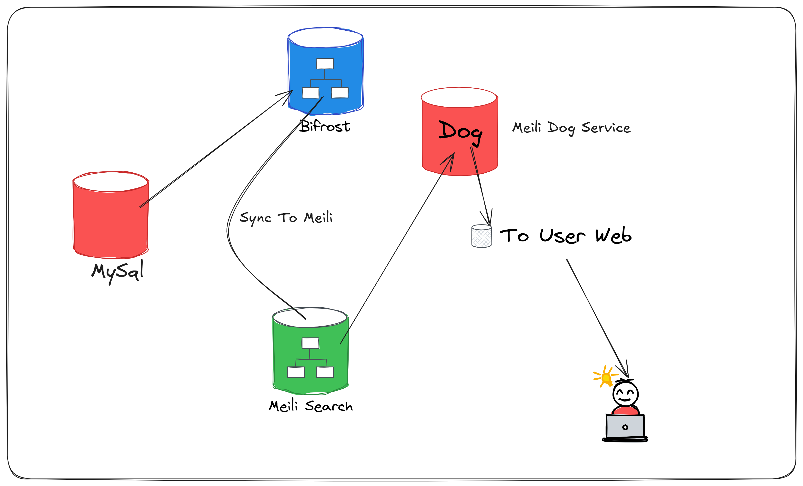

# Meili Dog - 简化 MeiliSearch 流程的 Go 服务

Meili Dog 是一个专为简化 MeiliSearch 使用流程而设计的 Go 语言服务。通过与 Bifrost 项目配合，提供开箱即用的搜索解决方案，让开发者能够快速集成强大的全文搜索功能。

## 主要特性

- 🚀 **开箱即用** - 简单配置即可快速启动搜索服务
- 🔧 **配置化管理** - 通过 TOML 配置文件管理所有设置
- 📊 **性能优化** - 内置搜索优化参数，提供最佳搜索体验
- 🔍 **智能设置** - 支持字段权重、过滤、排序等高级配置
- 🛡️ **稳定可靠** - 内置健康检查和错误处理机制
- 🌐 **多语言支持** - 提供 PHP、Python 等语言的客户端示例

## 实现流程


## 关于Bifrost
  因为官方现在没有meili 插件,所以我自己编写了一个meili Search插件.`非官方版Bifrost`[支持Meili Search 的Birfrost](https://github.com/ser163/bifrost "支持Meili Search 的Bifrost 版本")`

## 快速开始

### 环境要求

- Go 1.24 或更高版本
- MeiliSearch 服务（本地或远程）
- 至少 512MB 可用内存

### 安装步骤

#### 1. 下载项目

```bash
git clone https://github.com/ser163/meili_dog.git
cd meili_dog
```

#### 2. 安装依赖

```bash
go mod download
```

#### 3. 配置设置

创建配置文件 `config/config.toml`：

```toml
[server]
address = "http://localhost:7700"  # MeiliSearch 服务地址
api_key = "your_master_key_here"   # MeiliSearch API 密钥

[search]
index_uid = "my_index"  # 要使用的索引名称

[search.optimization]
attributes_to_crop = ["description", "content"]
attributes_to_highlight = ["title", "description"]
attributes_to_retrieve = ["*"]
attributes_to_search_on = ["title", "description", "content"]
crop_length = 200
highlight_pre_tag = "<em>"
highlight_post_tag = "</em>"
```

#### 4. 编译项目

```bash
# 开发模式
go build -o meili_dog main.go

# 生产模式
GOOS=linux GOARCH=amd64 go build -ldflags="-s -w" -o meili_dog main.go
```

#### 5. 运行服务

```bash
# 直接运行
go run main.go

# 或运行编译后的二进制文件
./meili_dog
```

服务将在 http://localhost:8081 启动。

## 配置说明

### 环境变量

| 变量名 | 默认值 | 说明 |
|--------|--------|------|
| `PORT` | `8081` | 服务监听端口 |
| `CONFIG_PATH` | `config/config.toml` | 配置文件路径 |
| `GIN_MODE` | `debug` | Gin 运行模式 (`debug`/`release`) |

### 配置文件详解

```toml
[server]
address = "http://localhost:7700"  # MeiliSearch 地址
api_key = "your_master_key_here"   # API 密钥

[search]
index_uid = "my_index"  # 索引名称

[search.optimization]
attributes_to_crop = ["description"]      # 需要裁剪的字段
attributes_to_highlight = ["title"]       # 需要高亮的字段
attributes_to_retrieve = ["*"]           # 返回的字段
attributes_to_search_on = ["title"]       # 搜索的字段
crop_length = 200                         # 裁剪长度
highlight_pre_tag = "<em>"               # 高亮开始标签
highlight_post_tag = "</em>"             # 高亮结束标签
```

## API 接口文档

### 健康检查

```http
GET /api/v1/health
```

响应：
```json
{
  "status": "healthy"
}
```

### 索引信息

```http
GET /api/v1/index
```

### 搜索接口

```http
GET /api/v1/search?query=关键词&page=1&limit=20
```

参数：
- `query` (必需): 搜索关键词
- `page`: 页码，默认 1
- `limit`: 每页数量，默认 20
- `filters`: 过滤条件（JSON 格式）
- `sort`: 排序字段

示例：
```bash
curl "http://localhost:8081/api/v1/search?query=apple&page=1&limit=10"
```

### 设置管理

#### 获取当前设置
```http
GET /api/v1/settings
```

#### 设置可搜索字段
```http
PUT /api/v1/settings/searchable-attributes
```
Body:
```json
{
  "searchable_attributes": ["title", "description"],
  "weights": {
    "title": 10,
    "description": 5
  }
}
```

#### 设置可过滤字段
```http
PUT /api/v1/settings/filterable-attributes
```
Body:
```json
{
  "filterable_attributes": ["category", "price", "status"]
}
```

#### 设置可排序字段
```http
PUT /api/v1/settings/sortable-attributes
```
Body:
```json
{
  "sortable_attributes": ["price", "created_at", "rating"]
}
```

#### 更新排序规则
```http
PUT /api/v1/settings/ranking-rules
```
Body:
```json
{
  "ranking_rules": [
    "words",
    "typo",
    "proximity",
    "attribute",
    "sort",
    "exactness"
  ]
}
```

#### 重置设置
```http
POST /api/v1/settings/reset
```

## 客户端示例

### PHP 客户端示例

```php
<?php
/**
 * Meili Dog PHP 客户端
 */
class MeiliDogClient {
    private $baseUrl;
    private $timeout;
    
    public function __construct($baseUrl = 'http://localhost:8081', $timeout = 10) {
        $this->baseUrl = rtrim($baseUrl, '/');
        $this->timeout = $timeout;
    }
    
    /**
     * 健康检查
     */
    public function health() {
        return $this->request('/api/v1/health');
    }
    
    /**
     * 执行搜索
     */
    public function search($query, $page = 1, $limit = 20, $filters = [], $sort = []) {
        $params = [
            'query' => $query,
            'page' => $page,
            'limit' => $limit
        ];
        
        if (!empty($filters)) {
            $params['filters'] = json_encode($filters);
        }
        
        if (!empty($sort)) {
            $params['sort'] = $sort;
        }
        
        return $this->request('/api/v1/search?' . http_build_query($params));
    }
    
    /**
     * 获取索引信息
     */
    public function getIndexInfo() {
        return $this->request('/api/v1/index');
    }
    
    /**
     * 获取设置
     */
    public function getSettings() {
        return $this->request('/api/v1/settings');
    }
    
    /**
     * 更新搜索设置
     */
    public function updateSearchSettings($searchableAttributes, $weights = []) {
        $data = [
            'searchable_attributes' => $searchableAttributes,
            'weights' => $weights
        ];
        
        return $this->request('/api/v1/settings/searchable-attributes', 'PUT', $data);
    }
    
    private function request($endpoint, $method = 'GET', $data = null) {
        $url = $this->baseUrl . $endpoint;
        
        $ch = curl_init();
        curl_setopt($ch, CURLOPT_URL, $url);
        curl_setopt($ch, CURLOPT_RETURNTRANSFER, true);
        curl_setopt($ch, CURLOPT_TIMEOUT, $this->timeout);
        curl_setopt($ch, CURLOPT_CUSTOMREQUEST, $method);
        
        if ($data && in_array($method, ['PUT', 'POST'])) {
            $jsonData = json_encode($data);
            curl_setopt($ch, CURLOPT_POSTFIELDS, $jsonData);
            curl_setopt($ch, CURLOPT_HTTPHEADER, [
                'Content-Type: application/json',
                'Content-Length: ' . strlen($jsonData)
            ]);
        }
        
        $response = curl_exec($ch);
        $httpCode = curl_getinfo($ch, CURLINFO_HTTP_CODE);
        curl_close($ch);
        
        if ($response === false) {
            throw new Exception('请求失败');
        }
        
        $result = json_decode($response, true);
        
        if ($httpCode !== 200) {
            throw new Exception($result['error'] ?? '请求错误', $httpCode);
        }
        
        return $result;
    }
}

// 使用示例
try {
    $client = new MeiliDogClient('http://localhost:8081');
    
    // 健康检查
    $health = $client->health();
    echo "服务状态: " . $health['status'] . "\n";
    
    // 执行搜索
    $results = $client->search('apple', 1, 10, ['category' => 'electronics']);
    echo "找到 " . $results['estimatedTotalHits'] . " 个结果\n";
    
    foreach ($results['hits'] as $hit) {
        echo "标题: " . ($hit['title'] ?? 'N/A') . "\n";
    }
    
} catch (Exception $e) {
    echo "错误: " . $e->getMessage() . "\n";
}
?>
```

### Python 客户端示例

```python
#!/usr/bin/env python3
"""
Meili Dog Python 客户端
"""

import requests
import json
from typing import Dict, List, Optional, Any

class MeiliDogClient:
    def __init__(self, base_url: str = "http://localhost:8081", timeout: int = 10):
        self.base_url = base_url.rstrip('/')
        self.timeout = timeout
        self.session = requests.Session()
    
    def health(self) -> Dict[str, Any]:
        """健康检查"""
        return self._request('GET', '/api/v1/health')
    
    def search(self, query: str, page: int = 1, limit: int = 20, 
               filters: Optional[Dict] = None, sort: Optional[List[str]] = None) -> Dict[str, Any]:
        """执行搜索"""
        params = {
            'query': query,
            'page': page,
            'limit': limit
        }
        
        if filters:
            params['filters'] = json.dumps(filters)
        
        if sort:
            params['sort'] = sort
        
        return self._request('GET', '/api/v1/search', params=params)
    
    def get_index_info(self) -> Dict[str, Any]:
        """获取索引信息"""
        return self._request('GET', '/api/v1/index')
    
    def get_settings(self) -> Dict[str, Any]:
        """获取当前设置"""
        return self._request('GET', '/api/v1/settings')
    
    def update_searchable_attributes(self, searchable_attributes: List[str], 
                                   weights: Optional[Dict[str, int]] = None) -> Dict[str, Any]:
        """更新可搜索字段"""
        data = {
            'searchable_attributes': searchable_attributes
        }
        
        if weights:
            data['weights'] = weights
        
        return self._request('PUT', '/api/v1/settings/searchable-attributes', data=data)
    
    def update_filterable_attributes(self, filterable_attributes: List[str]) -> Dict[str, Any]:
        """更新可过滤字段"""
        data = {
            'filterable_attributes': filterable_attributes
        }
        return self._request('PUT', '/api/v1/settings/filterable-attributes', data=data)
    
    def update_ranking_rules(self, ranking_rules: List[str]) -> Dict[str, Any]:
        """更新排序规则"""
        data = {
            'ranking_rules': ranking_rules
        }
        return self._request('PUT', '/api/v1/settings/ranking-rules', data=data)
    
    def reset_settings(self) -> Dict[str, Any]:
        """重置设置"""
        return self._request('POST', '/api/v1/settings/reset')
    
    def _request(self, method: str, endpoint: str, params: Optional[Dict] = None, 
                data: Optional[Dict] = None) -> Dict[str, Any]:
        """内部请求方法"""
        url = f"{self.base_url}{endpoint}"
        
        headers = {}
        if data and method in ['PUT', 'POST']:
            headers['Content-Type'] = 'application/json'
            data = json.dumps(data)
        
        try:
            response = self.session.request(
                method=method,
                url=url,
                params=params,
                data=data,
                headers=headers,
                timeout=self.timeout
            )
            
            response.raise_for_status()
            return response.json()
            
        except requests.exceptions.RequestException as e:
            raise Exception(f"请求失败: {e}")

# 使用示例
if __name__ == "__main__":
    client = MeiliDogClient('http://localhost:8081')
    
    try:
        # 健康检查
        health = client.health()
        print(f"服务状态: {health.get('status')}")
        
        # 获取索引信息
        index_info = client.get_index_info()
        print(f"索引UID: {index_info.get('index_uid')}")
        
        # 执行搜索
        results = client.search(
            query="apple",
            page=1,
            limit=10,
            filters={"category": "electronics"}
        )
        
        print(f"找到 {results.get('estimatedTotalHits', 0)} 个结果")
        
        for hit in results.get('hits', []):
            print(f"标题: {hit.get('title', 'N/A')}")
            
        # 更新搜索设置
        update_result = client.update_searchable_attributes(
            searchable_attributes=["title", "description", "content"],
            weights={"title": 10, "description": 5}
        )
        
        print(f"设置更新成功: {update_result.get('success')}")
        
    except Exception as e:
        print(f"错误: {e}")
```

## 与 Bifrost 配合使用

Meili Dog 设计为与 Bifrost 项目无缝配合，实现数据同步和搜索的一体化解决方案。

### 数据同步流程

1. **Bifrost 处理数据变更**
2. **实时同步到 MeiliSearch**
3. **Meili Dog 提供搜索接口**

### 配置示例

```toml
# bifrost 配置
[output.meilisearch]
enable = true
host = "http://localhost:7700"
api_key = "your_api_key"
index_uid = "my_index"

# meili_dog 配置
[search]
index_uid = "my_index"  # 与 Bifrost 使用相同的索引
```

## 性能优化建议

### 1. 搜索优化

- 合理设置 `attributes_to_search_on` 限制搜索字段范围
- 使用字段权重提升重要字段的搜索优先级
- 配置合适的 `crop_length` 平衡结果质量和性能

### 2. 索引优化

- 定期清理无用文档
- 使用合适的过滤字段减少搜索范围
- 配置合理的排序规则

### 3. 服务部署

- 使用反向代理（如 Nginx）进行负载均衡
- 配置合理的超时时间和重试机制
- 启用 Gzip 压缩减少网络传输

## 故障排除

### 常见问题

1. **连接失败**
    - 检查 MeiliSearch 服务是否运行
    - 验证配置中的地址和 API 密钥

2. **搜索无结果**
    - 确认索引中存在数据
    - 检查索引名称配置是否正确
    - 验证搜索字段配置

3. **性能问题**
    - 检查网络连接质量
    - 优化搜索参数配置
    - 考虑增加服务实例

### 日志查看

服务运行时会输出详细日志，可以通过日志诊断问题：

```bash
# 查看实时日志
tail -f meili_dog.log

# 搜索错误日志
grep "ERROR" meili_dog.log
```

## 开发指南

### 项目结构

```
meili_dog/
├── config/           # 配置管理
├── handlers/         # HTTP 处理器
├── models/           # 数据模型
├── main.go           # 程序入口
├── config.toml       # 配置文件示例
└── README.md         # 项目文档
```

### 添加新功能

1. 在 `models` 包中定义数据结构
2. 在 `handlers` 包中实现处理逻辑
3. 在 `main.go` 中注册路由
4. 更新配置文件结构（如需要）

### 测试

```bash
# 运行单元测试
go test ./...

# 运行集成测试
go test -v -tags=integration ./...
```

## 贡献指南

我们欢迎社区贡献！请遵循以下步骤：

1. Fork 本项目
2. 创建功能分支 (`git checkout -b feature/AmazingFeature`)
3. 提交更改 (`git commit -m 'Add some AmazingFeature'`)
4. 推送到分支 (`git push origin feature/AmazingFeature`)
5. 创建 Pull Request

## 许可证

本项目采用 MIT 许可证 - 查看 LICENSE 文件了解详情。

## 支持与联系

- 📧 邮箱：l3478830@163.com
- 💬 讨论区：https://github.com/ser163/meili_dog/discussions
- 🐛 问题反馈：https://github.com/ser163/meili_dog/issues

## 更新日志

### v1.0.0 (2025-11-10)
- ✅ 初始版本发布
- ✅ 基本搜索功能
- ✅ 设置管理接口
- ✅ 多语言客户端示例

---

**Meili Dog** - 让搜索变得简单！ 🐕🔍